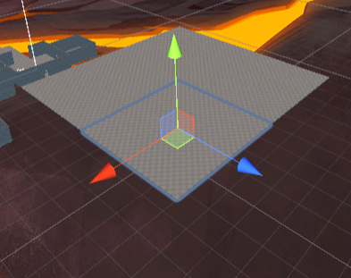
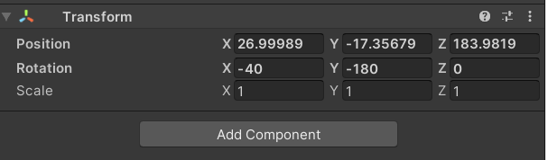
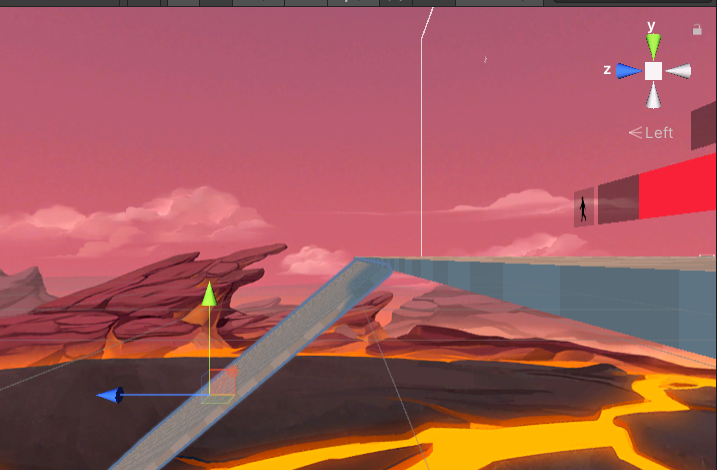
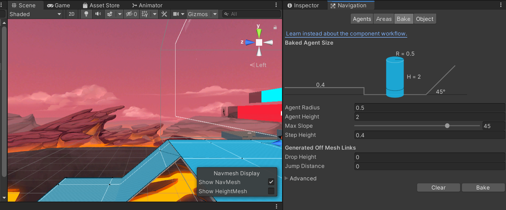
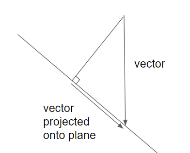
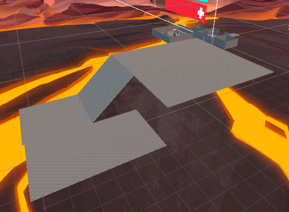

# Lesson 4A - Sliding About

This is a small addition to Lesson 4, where we explore solutions to a couple of the exercises

1. Fix the interaction between sprinting & sliding, so that you can go into a slide when landing, even when sprinting.
2. Devise a solution that allows a player to slide down a long slope until they reach the bottom.
3. Test & refine the realism of movement and acceleration when sliding on slopes.


### Sprint + Slide

The problem with sliding while sprinting is that there is some existing code to cancel crouching whenever the sprint button is held down.

That means that if we are in the air and holding the sprint button, when we crouch it immediately gets cancelled, which means that when we land, we aren't crouching, so we don't go into a slide.

The fix is to change the code that cancels crouching when sprinting, so that it only acts when we are on the ground.

Immediately after these lines...

```
bool isSprinting = m_InputHandler.GetSprintInputHeld();
        {
```

Replace this line...

`if (isSprinting)` 

.. this line...

`if (isSprinting  && isGrounded)`

Note that at the moment we land, the code that handles going into a slide is called before this code, so `isSliding` will be set before `isCrouching` gets cleared.

There is one more minor issue, however.  If we are sprinting, crouching will be cancelled as soon as we land on the ground.  This means that pressing the crouch button to uncrouch, and cancel the slide won't work when sprinting.

If we wanted to fix that, we could update the line we changed above to this:

`if (isSprinting  && isGrounded && !isSliding)`

This will ensure that sprinting won't cancel crouching until we stop sliding, meaning that we can uncrouch to exit sliding at any time - the same as when not sprinting.

### Building some Slopes

To test out sliding, we'll need to extend our play area to include some test slides.

We can do this as follows:

- Select a portion of the large floor, and press Ctrl-D to duplicate



- Use the Move Tool and Rotate Tools (top left) to move it into the desired position.


- Or you an make manual adjustments to the Transform directly in the GameObject Inspector Panel.

  

- Use the x, y, z view controls (top right of the scene view) to get exact side-on views, so that you can position your slope precisely.  Make sure you check at least 2 different angles.  Hold down the middle mouse wheel and move to reposition the camera for the best angles.



After you make your changes, there's one more update we need to do to make the new surface a part of the play area.

In the Hierarchy, find the "NavMeshSurface" game object.  Go to the "Navigation" tab, and the "Bake" sub-tab.  Press the "Bake" button to update the NavMesh to include the areas you added.

Note the "Max Slope" sider is set to 45 degrees.  If your slide is steeper than that, you'll need to increase that slope to get it included in the NavMesh.



The NavMesh provides a pre-calculated map of the spaces where the player can go, and allows the game engine to compute in-game movements more efficiently.

You'll need to update the NavMesh every time you update the shape of the play area.

### Let's Go Sliding!

I tested 3 different types of slide on the new slope:

- sliding down the slope
- sliding up the slope
- sliding across the slope

These all work pretty well - the only issue being the fact that we stop sliding after a second.

In particular:

- If we try to slide up the slope, we quickly slow down and slide backwards
- If we slide across the slope, we also build up speed down the slope.

We didn't write code to do any of that, so why does it work?

Recall that we set up sliding so that when we sere sliding, we'd be handled as if we were in the air.  The code that handles our movement is this.

```
            {
                // add air acceleration
                characterVelocity += worldspaceMoveInput * accelerationSpeedInAir * Time.deltaTime;

                // limit air speed to a maximum, but only horizontally
                float verticalVelocity = characterVelocity.y;
                Vector3 horizontalVelocity = Vector3.ProjectOnPlane(characterVelocity, Vector3.up);
                horizontalVelocity = Vector3.ClampMagnitude(horizontalVelocity, maxSpeedInAir * speedModifier);
                characterVelocity = horizontalVelocity + (Vector3.up * verticalVelocity);

                // apply the gravity to the velocity
                characterVelocity += Vector3.down * gravityDownForce * Time.deltaTime;
            }
            
```

This code has 3 parts to it, as per the comments.

- The first part is the bit that gives us some control of character movement in the air (or while sliding), as moderated by the "accelerationSpeedinAir" setting.  If you set "accelerationSpeedinAir" to 0, this code won't have any effect.
- The second part puts a limit on the speed the player can achieve in the air.  It's a little complicated because it splits out the horizontal and vertical components of the speed, so that it can clamp (limit) the horizontal parts, while not putting any limits on the vertical part (so that the character can fall at a realistically fast speed)
- The third part adds some very simple physics - basically it just applies freefall to our character.


So by itself, that doesn't explain the sliding behaviour we get.

That gets handled in this final section of code.  Before we implemented sliding, this only got invoked at the point of landing.  However when we are sliding, this is invoked on every frame.

```
        // detect obstructions to adjust velocity accordingly
        m_LatestImpactSpeed = Vector3.zero;
        if (Physics.CapsuleCast(capsuleBottomBeforeMove, capsuleTopBeforeMove, m_Controller.radius, characterVelocity.normalized, out RaycastHit hit, characterVelocity.magnitude * Time.deltaTime, -1, QueryTriggerInteraction.Ignore))
        {
            // We remember the last impact speed because the fall damage logic might need it
            m_LatestImpactSpeed = characterVelocity;

            characterVelocity = Vector3.ProjectOnPlane(characterVelocity, hit.normal);
        }
```


What this code does is:

- The "CapsuleCast" bit basically projects the player's collision capsule downwards in the direction of movement, and looks for a collision.
- If there's a collision, then we store off the velocity the character was moving at (for assessment of fall damage, which happens in the next frame)...
- ... and update the character's velocity vector using "ProjectOnPlane" - which gives us a vector like this:



This last part is what is giving us the sliding effect.  Each frame, the code is asking: "what if we were freefalling?", and then modifying the answer by making sure our movement stays within the plane we are on.

This is exactly the behaviour we need.  So let's fix up sliding so that we can slide for longer...

### Sliding for Longer

Currently, we stop sliding after a second, as controlled by this code:

```
        if (Time.time > slideStartTime + 1) {
            if (isSliding) {                
                isSliding = false;
                m_TargetCharacterHeight = capsuleHeightCrouching;                
            }
        }
```

Let's change it so that we stop sliding when our speed drops below some set threshold.

At the end of the parameters of PlayerCharacterController, add the following:

```
[Tooltip("Velocity at which we stop sliding")]
    public float stopSlideVelocity = 5f;
```


Now update the code above to the following:

            if (isSliding && characterVelocity.magnitude <  stopSlideVelocity) {                
                isSliding = false;
                m_TargetCharacterHeight = capsuleHeightCrouching;                
            }

characterVelocity is a vector, so to compare it with stopSlidingVelocity, a scalar (i.e. a number), we need to read its [magnitude](https://docs.unity3d.com/ScriptReference/Vector3-magnitude.html).

With this updated code, we'll stop sliding whenever we are sliding, and our velocity goes below a certain threshold.  The problem is that as things stand, wehen we're sliding on a flat surface we don't slow down - so we'll either slide forever, or not slide at all (which of these happens depends on the value set for "stopSlideVelocity").

One way to fix tis would be to adjust the code above like this>

        if (isSliding) {
            characterVelocity *= 0.99f;
        
            if (characterVelocity.magnitude <  stopSlideVelocity) {
                isSliding = false;
                m_TargetCharacterHeight = capsuleHeightCrouching;                
            }
        }

What this does is that each frame, it reduces the character velocity by 1%.  But there is a minor problem with this...  It means that the character's slowdown rate will depend on the game's frame rate, so it will vary depending on how powerful a computer is running the game.

We want all players to experience the same game physics.  So a better solution is to leave the code in the update() function unchanged, and instead add a new function:

```
    void FixedUpdate()
    {
        if (isSliding) {
            characterVelocity *= 0.99f;
        }
    }
```

[Fixed Update](https://docs.unity3d.com/ScriptReference/MonoBehaviour.FixedUpdate.html) is called at a fixed rate of 50 fps, regardless of the games overall frame rate, so making physics calculations in FixedUpdate gives us more stable behaviour.


Finally, we can do a bit of tidy-up.  We no longer need to track the time we've been sliding for, so find & remove these lines of code:

```
private float slideStartTime;
```

```
slideStartTime = Time.time;
```


If we test with this code, we'll see a few things:

- We can slide for short distances on the flat - longer if we are sprinting at the start of the slide
- We can slide down slopes indefinitely, and if we slide across slopes, we'll slide downwards as well
- We now lose the effect of sliding backwards when we try to slide up a slope.  Instead, we stop sliding almost instantly, as our slide velocity goes below the target level.


### Reworking Fall Damage

The following code implements fall damage.  This code only runs on landing (when `isGrounded` transitions from `false` to `true` ).  It checks the character's falling speed, and applies damage based on this.

```
            // Fall damage
            float fallSpeed = -Mathf.Min(characterVelocity.y, m_LatestImpactSpeed.y);
            float fallSpeedRatio = (fallSpeed - minSpeedForFallDamage) / (maxSpeedForFallDamage - minSpeedForFallDamage);
            if (recievesFallDamage && fallSpeedRatio > 0f)
            {
                float dmgFromFall = Mathf.Lerp(fallDamageAtMinSpeed, fallDamageAtMaxSpeed, fallSpeedRatio);
                m_Health.TakeDamage(dmgFromFall, null);

                // fall damage SFX
                audioSource.PlayOneShot(fallDamageSFX);
            }
            else
            {
                // land SFX
                audioSource.PlayOneShot(landSFX);
            }
```

Given the changes we've made, there's now a couple of problems with this:

- If you "land" on a steep slope, we shouldn't be giving fall damage.  The player's velocity doesn't change much, so there's no major impact on the player.
- On the other hand, if you slide down a steep slope and hit a wall, then fall damage probably should be applied - but the above code won't do anything because the player is already grounded.


One way to fix this is to apply fall damage not based on velocity on landing, but on change in velocity at any time: if the player's velocity changes from one frame to the next, we should apply fall damage, regardless of whether they are in the air or on the ground...

- Fly into a wall: fall damage
- Slide down a steep slope into a wall: fall damage
- Run into a wall: fall damage.
- Fall onto a drop-slide: no fall damage.

Maybe "fall damage" isn't quite the right term, but it's close enough...


To implement this, we make the following changes:

After this line...

```
Vector3 m_CharacterVelocity;
```

add this line, which adds another variable.

```
Vector3 m_LastCharacterVelocity = Vector3.zero;
```

Remove all the fall damage code quoted above, and instead, near the top of the Update() function, just after our sliding logic, add this:

```
        // Fall damage & landing SFX
        
        // compare velocity last frame with velocity this frame.
        float velocityChange = (characterVelocity - m_LastCharacterVelocity).magnitude;

        // store off velocity this frame for checks next frame
        m_LastCharacterVelocity = characterVelocity;
        
        if (velocityChange > minSpeedForFallDamage) {
         
            float fallSpeedRatio = (velocityChange - minSpeedForFallDamage) / (maxSpeedForFallDamage - minSpeedForFallDamage);
            float dmgFromFall = Mathf.Lerp(fallDamageAtMinSpeed, fallDamageAtMaxSpeed, velocityChange);
            m_Health.TakeDamage(dmgFromFall, null);

            // fall damage SFX
            audioSource.PlayOneShot(fallDamageSFX);
        }        
        else if (velocityChange > 5)
        {
            // land SFX
            audioSource.PlayOneShot(landSFX);
        }
```

Rather than looking at the absolute value of the character's y velocity, this code now applies fall damage based on *any* sudden change in velocity from one frame to the next.

The previous "fall damage" code was also taking care of a "landing" sound effect for the case where the player lands after a jump.  Again, we'd like this sound effect to play whenever we come to a sudden stop, whether it's after a jump, after a slide, or whatever.

I picked 5 as a threshold for playing this sound, which is enough to ensure it plays after a regular jump.  You could easily tune this value, or even make it configurable.

To test out fall damage, I added another section to my play areas, so that you can jump off a high area and land in a lower area.  I was able to confirm that sliding down the slope could be done without fall damage, but jumping straight off did lead to fall damage.




### Wrapping up

To wrap up, let's revisit what we were trying to cover:

1. Fix the interaction between sprinting & sliding, so that you can go into a slide when landing, even when sprinting.
   - We fixed this, then fixed a follow-on issue to ensure that you could "uncrouch" out of a slide that you sprinted into.
2. Devise a solution that allows a player to slide down a long slope until they reach the bottom.
   - Fixed by ending slides based on movement speed, rather than a timer.
3. Test & refine the realism of movement and acceleration when sliding on slopes.
   - The movement on slopes we got with the existing code was actually pretty good.  The one area we had to fix up was fall damage.

