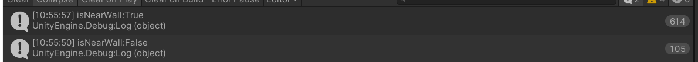
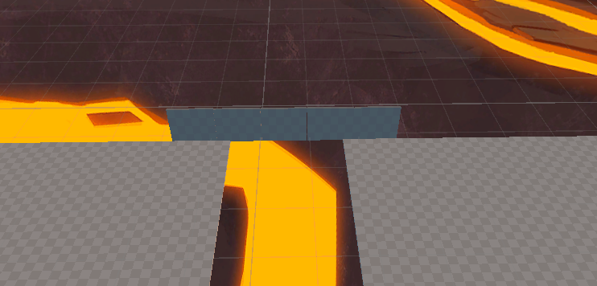
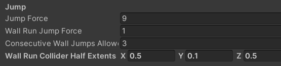

# Lesson 5 - Player Movement (Part 2)

Last lesson, we started looking at player movement controls, and added a basic sliding mechanic.

This lesson, we're going to add some new mechanics: wall jumping and wall running.


### Wall Jumping

As with sliding, we need to start by getting some clarity about exactly what we want to implement.

Our plan is to add a mechanism to detect when we are close to a wall.  We'll then allow use of the "jump" button in mid-air when close to the wall.

We'll want to make some adjustments to the strength of the jump, and the amount of time you can wall-run for, but we'll look at those details once we have a basic mechanism working.


### Detecting when the Player is Close to a Wall

We want to specifically detect when the player's *feet* are close to a wall - if a player's head is close to a wall, but their feet aren't, they shouldn't be able to wall run.

So we can't re-use the player's existing capsule collider - instead we need a new collider covering the area around the player's feet.

The simplest collider to use in this case is a Box Collider.

In fact, we don't even need to create a collider Game Object, we can just use the [Physics.CheckBox](https://docs.unity3d.com/ScriptReference/Physics.CheckBox.html) function.

This requires just 2 parameters:

- The center of the box to check for collisions
- The "half-extents" of the box to check for collisions.
  - ("half-extents" means half of the total width, height and depth of teh box, i.e. how far from the center of the box to it's edge in each direction)

(there are a few other optional parameters, but we don't need to use these at this stage).

To center the box on the player's feet, we can just use the player Game Object's position (the "Player" prefab is set up so that 0, 0, 0 is the base of the player, rather than the center of the player).

So the only configuration we need is the "half extents".

We can add configuration for this to the "Player Character Controller" component, by adding the following lines to the `PlayerCharacterController.cs` script.

The default value of 0.5, 0.1, 0.5 gives us a 1m x 1m square around the player's feet, 20cm high.  Wall running will work when there is an object within this area.


    [Tooltip("Half-extents of collider used for wall running")]
    public Vector3 wallRunColliderHalfExtents = new Vector3(0.5f, 0.1f, 0.5f);

I added this just below these lines, so that it appears just below this setting in the inspector view,

```
    [Tooltip("Force applied upward when jumping")]
    public float jumpForce = 9f;
```

Here's what the new setting looks like in the inspector:


Now, we need to write some code that checks for collisions around the player's position.

We follow the same pattern used for other player states:

- a global variable declared near the top of the module that tracks whether the player is near a wall:

```public bool isNearWall { get; private set; }```

- a function that checks whether the player is near a wall.  Note that this includes a Debug log so we can see what's going on - we'll remove this later

     void NearWallCheck()
    {
    
        // reset values before the ground check
        isNearWall = false;
        
        isNearWall = (Physics.CheckBox(transform.position, wallRunColliderHalfExtents));
        Debug.Log("isNearWall:" + isNearWall);
    
    }

- a call to this function on every frame to ensure it's always up-to-date.  We add this into the `Update()` function, immediately after the call to `GroundCheck()`

```
NearWallCheck();
```


We can test this out by starting up the game with "Maximize on Play" deselected - this way we can monitor the console logs as we play.

When we do this, we should see:

- isNearWall is "true" whenever the player is on the ground (this is detecting a collision with the ground itself)
- isNearWall is "false" when the player is in the air, *unless* they are also close to a wall, in which case it stays "true".

Test this out...




So "isNearWall" doesn't exactly match it's name, as it's true whenever the player is on the floor as well, but it's good enough for us to use as a basis for wall running, because when the player is in the air, we can use it to detect whether or not they are close to a wall.


### Enable Wall Jumping

Now we have an indicator that tells us when we are near a wall, we can use it to implement wall-jumping.

We just need to modify this line...

```
        // jumping
        if ((isGrounded) && m_InputHandler.GetJumpInputDown())
```

... to this....

```
        // jumping
        if ((isGrounded || isNearWall) && m_InputHandler.GetJumpInputDown())
```

I built myself a wall-running test ground (see Lesson 4A for pointers on this, and remember Ctrl-D to duplicate objects), and was able to use the new wall-jumping function to get across the gap.





### Reducing the power of Wall Jumping

This basic "wall jumping" function is a little over-powered as the player is able to wall-jump with just as much power as they can jump from the ground.

They can also wall jump as many times as they like.  This is similar to how wall-jumping works in 2D Mario games - it could be fun, but for a more realistic style of game, we might want to make the move a bit less powerful.

There's 2 simple changes we can make:

- Reduce the power of wall jumps relative to grounded jumps

- Reduce the number of wall jumps you can perform (or the amount of time that you can wall run for).


Let's look at reducing the power of wall jumps first.  Here's the code that implements jumping.

```
                // start by canceling out the vertical component of our velocity
                characterVelocity = new Vector3(characterVelocity.x, 0f, characterVelocity.z);

                // then, add the jumpSpeed value upwards
                characterVelocity += Vector3.up * jumpForce;
```

it uses this parameter on the 

```
    [Tooltip("Force applied upward when jumping")]
    public float jumpForce = 9f;
```


To make wall jumping less powerful, we create another parameter, wuth a different (lower) default value...

```
    [Tooltip("Force applied upward when jumping off a wall")]
    public float wallRunJumpForce = 1f;
```

... and update the code above to use this value instead when we are wall running (i.e. when we are not on the ground).

We replace this line...

```
                // then, add the jumpSpeed value upwards
                characterVelocity += Vector3.up * jumpForce;
```

... with this:

```
                // then, add the jumpSpeed value upwards (up-force depends whether grounded or wall-running)
                if (isGrounded)
                {
                    characterVelocity += Vector3.up * jumpForce;
                }
                else 
                {
                    characterVelocity += Vector3.up * wallRunJumpForce;
                }
```


### Reducing the number of Wall Jumps allowed

We can also reduce the number of consecutive wall jumps allowed as follows:

At the top of the file add this configurable parameter:

```
    [Tooltip("Number of consecutive wall jumps permitted")]
    public int consecutiveWallJumpsAllowed = 3f;
```

... and this variable...

```
int m_wallRunStepsAvailable;
```


Then modify the jumping if test to the following:

```
        // jumping
        if ((isGrounded || (isNearWall &&  m_wallRunStepsAvailable > 0)) && m_InputHandler.GetJumpInputDown())
```

... and manage the available steps like this:

```
                if (isGrounded)
                {
                    characterVelocity += Vector3.up * jumpForce;
                    m_wallRunStepsAvailable = consecutiveWallJumpsAllowed;
                }
                else
                {
                    m_wallRunStepsAvailable--;
                    characterVelocity += Vector3.up * wallRunJumpForce;
                }
```


Note that we are using an "int" rather than a "float" here.  An int can take values 0, 1, 2, 3 (and also -1, -2 etc.), but can't take decimal values like 0.1 or 1.321.  A float can take a value with numbers before and after the decimal point.

For counting steps, it's more natural to use an int than a float.

(another note: the reason the variable name begins with m_ is that this is a convention for "member variables", that is variables that are available throughout this object, but private to it.  The code would work just fine without the m_ in the name, but the prefix  helps developers to remember what the scope of a particular variable is).

Here's what all those settings look like in the inspector:




### Wall Running

We can now use repeated jumps to perform a kind of wall-running, but we might want to use a different control scheme.

Another common approach to wall running is that when a player jumps at a wall, moving at a sufficient speed they "lock on" to the wall for a defined period of time, during which they can run along the wall.

We're now going to look at implementing that.


Here's how we could go about implementing such a scheme.

- define new parameters on the PlayerCharacterController script:
  - how long the player can wall run for
  - the player's minimum speed for wall running to "lock on"

- define a new member variable that tracks the time at which we started wall running.

- Add another boolean state `isWallRunning`, and manage this as follows:

  - it becomes "true" when...

    - it's not already "true"
    - `isGrounded` is false
    - `isNearWall` is true
    - the player's speed (`CharacterVelocity.magnitude`) is above the minimum required level.

    This can be implemented in the `Update()` function after calls to the `GroundCheck()` and `NearWallCheck()` 

    When setting the state to true, record the time we started wall running in the new member variable, using `Time.time` (we also used this with our initial implementation of sliding in Lesson 4)

  - it becomes "false" when any of the following happen

    - the time now (`Time.time`) is greater than the wall running start time + the allowed wall running time.
    - the player touches the ground (`isGrounded` is true)
    - the player stops being near a wall (`isNearWall` is false)
    - the player's speed (`CharacterVelocity.magnitude`) is below the minimum required level.

- Finally, in `HandleCharacterMovement()`, we need to make the wall running actually happen.

  - the best way to achieve this is to go into the "grounded movement" branch in `HandleCharacterMovement()` when `isWallRunning` is set.  This has the benefit of not only *not* applying gravity, but also implementing footstep sounds - which we also want when wall running.

The exact lines of code needed to implement the above are left for you as an exercise... (but see below if you get stuck)


### Exercises

- Implement the code for the "wall running" implementation described above

- Can you make Weapon Bobbing working with wall running?  Weapon Bobbing is implemented in the `PlayerWeaponsManager` script.

- Can you make the wall running duration depend on the player's speed, rather than having a fixed duration?

  

### Answers

#### Wall Running

Here are some lines of code that can be used to implement Wall Running with a timer-based "lock on" as described above...

new parameters:

```
    [Tooltip("Wall running max duration")]
    public float wallRunMaxDuration = 2f;

    [Tooltip("Wall running min speed")]
    public float wallRunMinSpeed = 15f;
```

Explanation of the default values:

- the first value gives up to 2 seconds of wall running.
- a min speed for 15 compares to a default max speed of 13 and a default max sprint speed of 13 x 1.5 = 19.5.  So this means you can wall run only when sprinting.
  - Bear in mind that depending on the angle of approach, the player will lose a small amount of speed as their movement is adjusted to match the direction of the wall.
  - The speed and sprint speed are also configurable through the "Max Speed on Ground" and "Sprint Speed Modifier"


new member variable:

```
    float m_wallRunStartTime;
```

new boolean state:

```
    public bool isWallRunning { get; private set; }
```


code to add to `Update()` just after `GroundCheck()` and `NearWallCheck()`:

```
        // wall running start
        if (!isWallRunning && 
            !isGrounded &&
            isNearWall &&
            characterVelocity.magnitude >= wallRunMinSpeed)
        {
            isWallRunning = true;
            m_wallRunStartTime = Time.time;
        }

        // wall running end
        if (isWallRunning)
        {
            if (isGrounded ||
                !isNearWall ||
                Time.time > m_wallRunStartTime + wallRunMaxDuration ||
                characterVelocity.magnitude < wallRunMinSpeed)
            {
                isWallRunning = false;
            }
        }
```

code to handle as grounded movement when wall running...  change this....

```
            // handle grounded movement
            if (isGrounded && !isSliding)
```

... to this...

                // handle grounded movement
                if ((isGrounded || isWallRunning) && !isSliding)


For testing this, you may want to disable wall jumping, which you can do by setting "Consecutive Wall Jumps Allowed" to 0.


#### Weapon Bobbing

A fairly simple update to the `PlayerWeaponsManager` script.

Change these lines...

```
            if (m_PlayerCharacterController.isGrounded  &&
                !m_PlayerCharacterController.isSliding)
```

... to this...

```
            if ((m_PlayerCharacterController.isGrounded ||
                 m_PlayerCharacterController.isWallRunning) &&
                !m_PlayerCharacterController.isSliding)
```


#### Wall Run Duration

There's lots of different solutions here depending on what exact behaviour you want.

Is the wall run duration dependent on the speed when the player first contacts the wall, or their speed while wall running?

A couple of possible solutions:

1. when wall running starts, set a new member variable to the allowed value for this wall run, based on the player's speed at that moment (combined with the parameters configured on the player)
2. when deciding whether to end wall running, factor the player's current speed into the question of whether to time out wall running.  You could set up a scheme where for every second the player is wall running, they have to attain a higher speed in order to continue wall running.

Details of the exact code for either solution are left to you....

